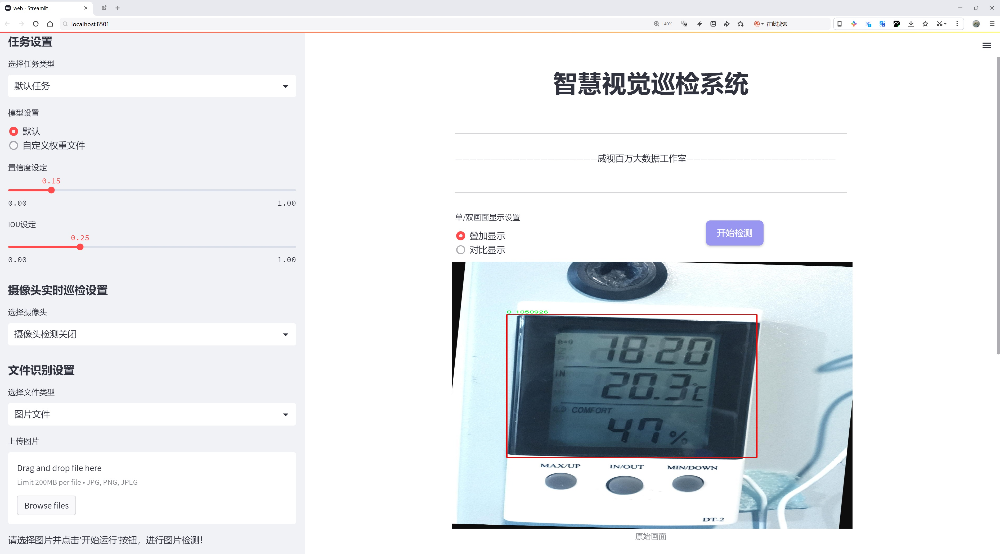
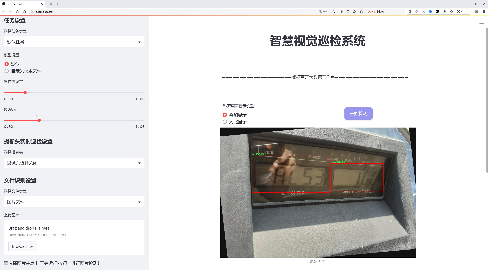
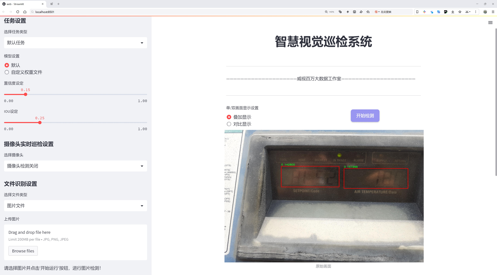
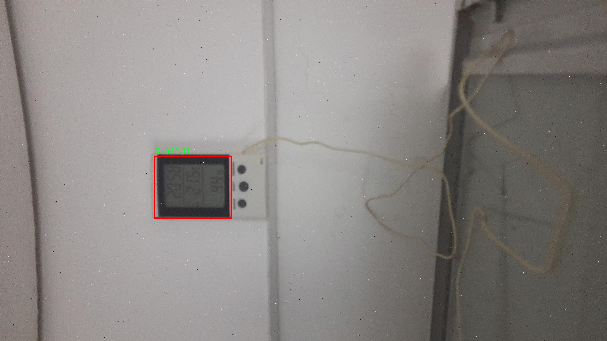
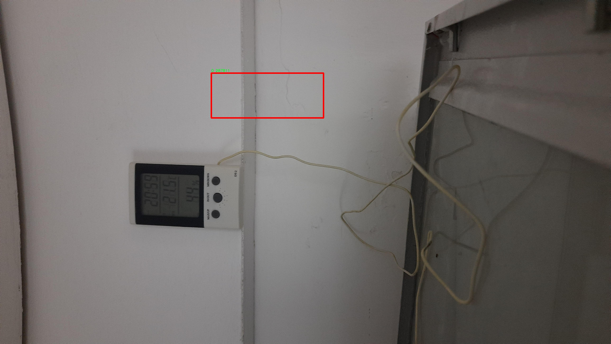
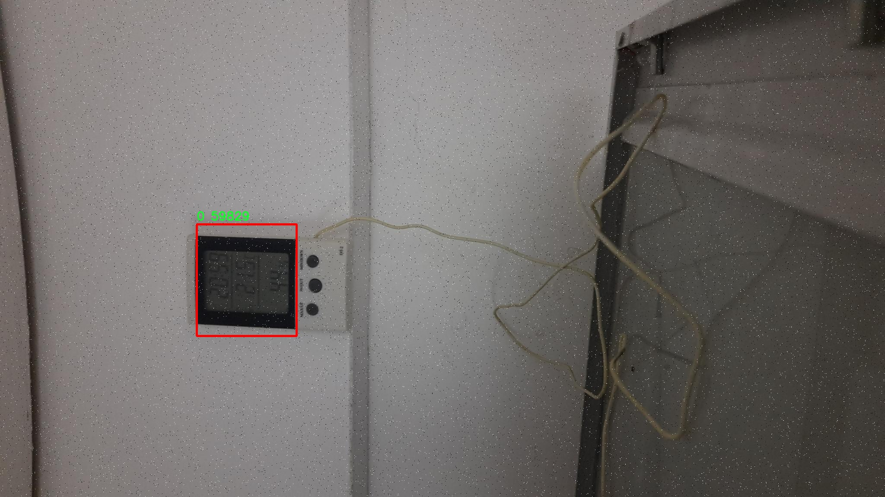
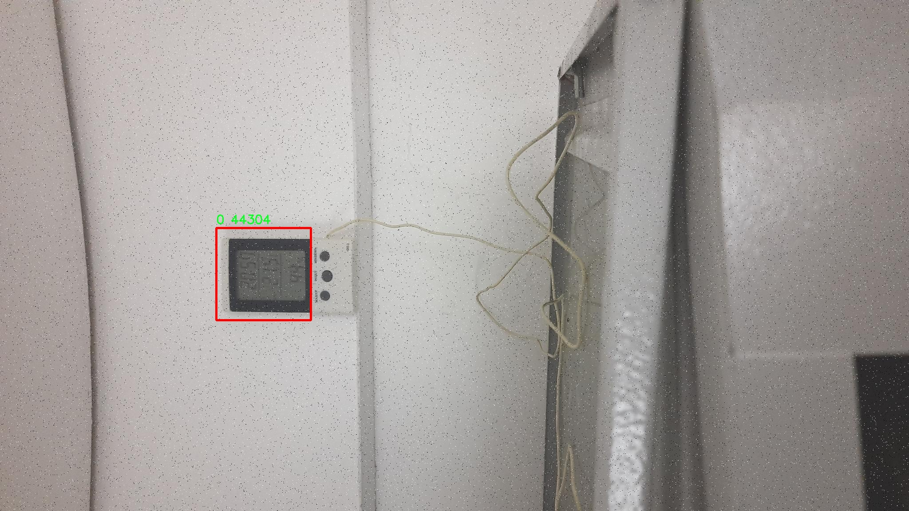
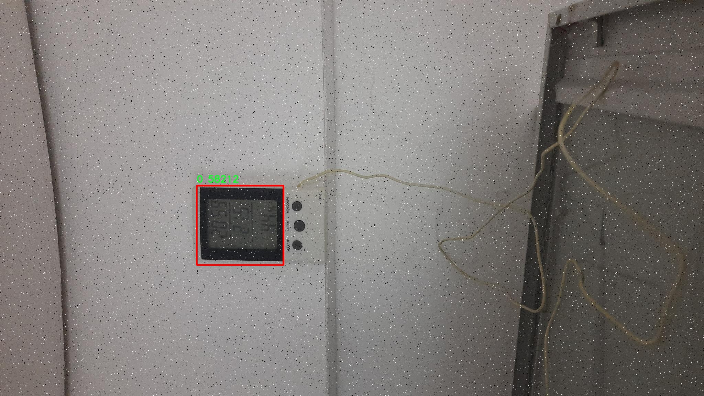

# 显示屏检测检测系统源码分享
 # [一条龙教学YOLOV8标注好的数据集一键训练_70+全套改进创新点发刊_Web前端展示]

### 1.研究背景与意义

项目参考[AAAI Association for the Advancement of Artificial Intelligence](https://gitee.com/qunshansj/projects)

项目来源[AACV Association for the Advancement of Computer Vision](https://gitee.com/qunmasj/projects)

研究背景与意义

随着信息技术的迅猛发展，显示屏作为信息传递和人机交互的重要媒介，广泛应用于各个领域，包括广告、交通、医疗和教育等。随着显示屏数量的激增，如何高效、准确地检测和识别显示屏的状态与内容，成为了计算机视觉领域亟待解决的关键问题。传统的显示屏检测方法往往依赖于人工标注和规则设定，效率低下且易受环境因素的影响，难以适应复杂多变的实际应用场景。因此，基于深度学习的自动化检测技术应运而生，尤其是目标检测算法在图像处理中的应用，展现出了良好的性能和广阔的前景。

YOLO（You Only Look Once）系列算法因其高效的实时检测能力和较高的准确率，逐渐成为目标检测领域的研究热点。YOLOv8作为该系列的最新版本，结合了更先进的网络结构和优化策略，能够在保持高精度的同时显著提升检测速度。然而，针对特定应用场景的YOLOv8模型仍需进行改进和优化，以适应不同的检测需求。特别是在显示屏检测任务中，如何有效地处理背景复杂、光照变化、显示内容多样等问题，成为了研究的重点。

本研究旨在基于改进的YOLOv8模型，构建一个高效的显示屏检测系统。为此，我们将利用一个包含4680张图像的数据集，专注于单一类别的显示屏检测。该数据集的构建和使用，不仅为模型的训练提供了丰富的样本，还为后续的性能评估奠定了基础。通过对数据集的深入分析，我们可以更好地理解显示屏在不同环境下的特征，从而为模型的改进提供数据支持。

本研究的意义在于，首先，通过改进YOLOv8模型，我们期望能够提升显示屏检测的准确性和实时性，为相关行业提供更加智能化的解决方案。其次，构建高效的显示屏检测系统，不仅可以降低人工干预的成本，还能在广告投放、交通监控等领域实现更高效的信息管理和决策支持。此外，本研究还将为目标检测领域的其他应用提供借鉴，推动计算机视觉技术在更广泛场景中的应用。

最后，随着人工智能技术的不断进步，显示屏检测系统的研究将为未来的智能城市、智慧交通和智能家居等领域的发展提供重要的技术支撑。通过本研究，我们希望能够为显示屏检测技术的发展贡献一份力量，推动相关领域的技术创新与应用落地。

### 2.图片演示







##### 注意：由于此博客编辑较早，上面“2.图片演示”和“3.视频演示”展示的系统图片或者视频可能为老版本，新版本在老版本的基础上升级如下：（实际效果以升级的新版本为准）

  （1）适配了YOLOV8的“目标检测”模型和“实例分割”模型，通过加载相应的权重（.pt）文件即可自适应加载模型。

  （2）支持“图片识别”、“视频识别”、“摄像头实时识别”三种识别模式。

  （3）支持“图片识别”、“视频识别”、“摄像头实时识别”三种识别结果保存导出，解决手动导出（容易卡顿出现爆内存）存在的问题，识别完自动保存结果并导出到tempDir中。

  （4）支持Web前端系统中的标题、背景图等自定义修改，后面提供修改教程。

  另外本项目提供训练的数据集和训练教程,暂不提供权重文件（best.pt）,需要您按照教程进行训练后实现图片演示和Web前端界面演示的效果。

### 3.视频演示

[3.1 视频演示](https://www.bilibili.com/video/BV1B7tAeKEfw/)

### 4.数据集信息展示

##### 4.1 本项目数据集详细数据（类别数＆类别名）

nc: 1
names: ['0']


##### 4.2 本项目数据集信息介绍

数据集信息展示

在本研究中，我们采用了名为“Display”的数据集，以支持对YOLOv8模型在显示屏检测任务中的改进和优化。该数据集专注于单一类别的显示屏检测，类别数量为1，具体类别标识为“0”。这一简化的类别设置使得数据集在训练过程中能够集中精力于显示屏的特征提取与识别，避免了多类别之间的干扰，从而提高了模型的检测精度和效率。

“Display”数据集的构建旨在为显示屏的自动检测提供丰富的样本和多样化的场景。数据集中包含了多种不同类型的显示屏图像，这些图像来源于不同的环境和光照条件，涵盖了室内和室外的各种情况。通过这种多样化的样本选择，数据集能够有效地模拟现实世界中显示屏的不同表现形式，从而为YOLOv8模型的训练提供更为全面的特征学习基础。

在数据集的标注过程中，我们采用了高精度的标注工具，确保每一张图像中的显示屏区域都被准确地框定。这一过程不仅提升了数据集的质量，也为后续的模型训练奠定了坚实的基础。由于显示屏的外观和背景可能存在显著差异，数据集中的图像被精心挑选，以确保模型能够学习到显示屏在各种背景下的特征。这种特征的多样性是提高模型泛化能力的关键，有助于模型在实际应用中更好地适应不同的环境。

此外，为了增强模型的鲁棒性，我们还在数据集中引入了一些数据增强技术。这些技术包括随机裁剪、旋转、亮度调整等，旨在通过人工合成的方式扩展数据集的规模和多样性。这种数据增强不仅可以增加训练样本的数量，还能帮助模型在面对不同的显示屏角度、光照变化和背景干扰时，保持较高的检测准确率。

在训练过程中，我们将“Display”数据集与YOLOv8模型相结合，利用其先进的深度学习架构和特征提取能力，进行高效的训练。YOLOv8模型以其出色的实时检测性能和较低的计算复杂度，成为显示屏检测任务的理想选择。通过对“Display”数据集的深入学习，模型能够逐步掌握显示屏的形状、颜色、纹理等特征，从而实现高效、准确的检测。

总之，“Display”数据集为改进YOLOv8的显示屏检测系统提供了重要的支持。通过高质量的样本、精确的标注和有效的数据增强策略，该数据集不仅提升了模型的训练效果，也为后续的实际应用提供了坚实的基础。随着研究的深入，我们期待“Display”数据集能够为显示屏检测领域带来新的突破，推动相关技术的进步与发展。











### 5.全套项目环境部署视频教程（零基础手把手教学）

[5.1 环境部署教程链接（零基础手把手教学）](https://www.ixigua.com/7404473917358506534?logTag=c807d0cbc21c0ef59de5)


[5.2 安装Python虚拟环境创建和依赖库安装视频教程链接（零基础手把手教学）](https://www.ixigua.com/7404474678003106304?logTag=1f1041108cd1f708b01a)

### 6.手把手YOLOV8训练视频教程（零基础小白有手就能学会）

[6.1 手把手YOLOV8训练视频教程（零基础小白有手就能学会）](https://www.ixigua.com/7404477157818401292?logTag=d31a2dfd1983c9668658)

### 7.70+种全套YOLOV8创新点代码加载调参视频教程（一键加载写好的改进模型的配置文件）

[7.1 70+种全套YOLOV8创新点代码加载调参视频教程（一键加载写好的改进模型的配置文件）](https://www.ixigua.com/7404478314661806627?logTag=29066f8288e3f4eea3a4)

### 8.70+种全套YOLOV8创新点原理讲解（非科班也可以轻松写刊发刊，V10版本正在科研待更新）

由于篇幅限制，每个创新点的具体原理讲解就不一一展开，具体见下列网址中的创新点对应子项目的技术原理博客网址【Blog】：


[8.1 70+种全套YOLOV8创新点原理讲解链接](https://gitee.com/qunmasj/good)

### 9.系统功能展示（检测对象为举例，实际内容以本项目数据集为准）

图9.1.系统支持检测结果表格显示

  图9.2.系统支持置信度和IOU阈值手动调节

  图9.3.系统支持自定义加载权重文件best.pt(需要你通过步骤5中训练获得)

  图9.4.系统支持摄像头实时识别

  图9.5.系统支持图片识别

  图9.6.系统支持视频识别

  图9.7.系统支持识别结果文件自动保存

  图9.8.系统支持Excel导出检测结果数据


### 10.原始YOLOV8算法原理

原始YOLOv8算法原理

YOLOv8（You Only Look Once version 8）是目标检测领域中的一个重要进展，它在YOLO系列算法的基础上进行了多项创新和优化，旨在提升目标检测的速度和精度。该算法的设计理念围绕着快速、准确和易于使用的原则，广泛适用于目标检测、图像分割和图像分类等任务。YOLOv8的网络结构主要由三个部分组成：Backbone、Neck和Head，每个部分都在前代YOLO算法的基础上进行了改进。

在Backbone部分，YOLOv8采用了一系列卷积和反卷积层来提取图像特征，同时引入了残差连接和瓶颈结构，以减小网络的大小并提高性能。YOLOv8的Backbone使用了C2模块作为基本构成单元，包含5个CBS模块、4个C2f模块和1个快速空间金字塔池化（SPPF）模块。C2f模块的设计灵感来源于YOLOv7中的ELAN模块，旨在通过并行更多的梯度流分支来提高特征提取的效率和精度。这种结构不仅保证了网络的轻量化，还能够在较低的延迟下获得更丰富的梯度流信息，从而提升模型的整体性能。

在Neck部分，YOLOv8引入了多尺度特征融合技术，将来自Backbone不同阶段的特征图进行融合，以更好地捕捉不同尺度目标的信息。这一过程显著提高了目标检测的性能和鲁棒性。YOLOv8在Neck部分去除了YOLOv5中的两次上采样（Upsample）之前的1×1卷积连接层，直接对Backbone不同阶段输出的特征进行上采样。这种简化的结构使得特征融合更加高效，减少了计算量，同时保持了高质量的特征信息。

YOLOv8的Head部分是其最大的变化之一，采用了从Coupled-Head（耦合头）转变为Decoupled-Head（解耦头）的设计。传统的YOLO算法在Head结构中，检测和分类任务共用一个卷积层，而YOLOv8则将这两个任务解耦，分别使用两个1×1的卷积模块进行类别预测和边界框位置预测。这种解耦设计使得模型在处理复杂场景时能够更好地聚焦于目标的特征，从而提高检测精度。此外，YOLOv8在损失函数的设计上也进行了创新，取消了Obj分支，采用BCELoss（Binary Cross Entropy Loss）和DFL（Distribution Focal Loss）结合CIoULoss（Complete Intersection over Union Loss）的方法，以便更快地聚焦于标签附近的数值，提升模型的收敛速度和精度。

YOLOv8还摒弃了以往的Anchor-Based（基于锚框）思想，转而采用Anchor-Free（无锚框）的方法。这一转变使得目标检测的过程变得更加灵活和高效。传统的Anchor-Based方法需要预设锚框的大小和比例，并通过计算IoU（Intersection over Union）来优化目标位置，这不仅增加了计算复杂度，还在处理不同尺度和形状的目标时显得不够灵活。而YOLOv8的Anchor-Free方法则将目标检测转化为关键点检测，不再依赖于预设的锚框，从而简化了网络结构，提高了模型的泛化能力。

在输入部分，YOLOv8的默认输入图像尺寸为640×640，但在实际应用中，图像的长宽比往往各不相同。为了解决这一问题，YOLOv8在测试和推理时采用自适应图片缩放的方法，将长的一边按比例缩小到指定尺寸，然后对缩小后的短边进行填充。这种方法有效减少了信息冗余，提高了目标检测和推理的速度。此外，YOLOv8在训练过程中还引入了Mosaic图像增强操作，通过随机将四张图像进行缩放和拼接，迫使模型学习新的位置和不同周围像素，从而提高了模型的预测精度。

总的来说，YOLOv8通过对Backbone、Neck和Head部分的创新设计，结合Anchor-Free的目标检测方法，显著提升了目标检测的性能和灵活性。其在特征提取、特征融合和最终检测的每一个环节都进行了精心的优化，使得YOLOv8不仅在速度上具备优势，同时在精度上也达到了新的高度。这些改进使得YOLOv8成为了目标检测领域中的一款强大工具，适用于各种复杂的应用场景。随着YOLOv8的推出，目标检测技术的研究和应用将迎来新的机遇与挑战。


### 11.项目核心源码讲解（再也不用担心看不懂代码逻辑）

#### 11.1 70+种YOLOv8算法改进源码大全和调试加载训练教程（非必要）\ultralytics\models\sam\modules\decoders.py

以下是对代码中最核心部分的分析和详细注释：

```python
import torch
from torch import nn
from typing import List, Tuple, Type

class MaskDecoder(nn.Module):
    """
    MaskDecoder类用于生成掩码及其质量评分，使用变换器架构根据图像和提示嵌入预测掩码。
    """

    def __init__(
        self,
        *,
        transformer_dim: int,
        transformer: nn.Module,
        num_multimask_outputs: int = 3,
        activation: Type[nn.Module] = nn.GELU,
        iou_head_depth: int = 3,
        iou_head_hidden_dim: int = 256,
    ) -> None:
        """
        初始化MaskDecoder类。

        Args:
            transformer_dim (int): 变换器模块的通道维度
            transformer (nn.Module): 用于预测掩码的变换器
            num_multimask_outputs (int): 预测的掩码数量
            activation (nn.Module): 用于上采样掩码的激活函数类型
            iou_head_depth (int): 用于预测掩码质量的MLP深度
            iou_head_hidden_dim (int): 用于预测掩码质量的MLP隐藏维度
        """
        super().__init__()
        self.transformer_dim = transformer_dim  # 变换器的通道维度
        self.transformer = transformer  # 变换器模块

        self.num_multimask_outputs = num_multimask_outputs  # 多掩码输出数量

        # IoU token和mask tokens的嵌入
        self.iou_token = nn.Embedding(1, transformer_dim)  # IoU token的嵌入
        self.num_mask_tokens = num_multimask_outputs + 1  # mask tokens数量
        self.mask_tokens = nn.Embedding(self.num_mask_tokens, transformer_dim)  # mask tokens的嵌入

        # 输出上采样网络
        self.output_upscaling = nn.Sequential(
            nn.ConvTranspose2d(transformer_dim, transformer_dim // 4, kernel_size=2, stride=2),
            nn.LayerNorm(transformer_dim // 4),
            activation(),
            nn.ConvTranspose2d(transformer_dim // 4, transformer_dim // 8, kernel_size=2, stride=2),
            activation(),
        )

        # 超网络MLP列表，用于生成掩码
        self.output_hypernetworks_mlps = nn.ModuleList([
            MLP(transformer_dim, transformer_dim, transformer_dim // 8, 3) for _ in range(self.num_mask_tokens)
        ])

        # 预测掩码质量的MLP
        self.iou_prediction_head = MLP(transformer_dim, iou_head_hidden_dim, self.num_mask_tokens, iou_head_depth)

    def forward(
        self,
        image_embeddings: torch.Tensor,
        image_pe: torch.Tensor,
        sparse_prompt_embeddings: torch.Tensor,
        dense_prompt_embeddings: torch.Tensor,
        multimask_output: bool,
    ) -> Tuple[torch.Tensor, torch.Tensor]:
        """
        根据图像和提示嵌入预测掩码。

        Args:
            image_embeddings (torch.Tensor): 图像编码器的嵌入
            image_pe (torch.Tensor): 图像嵌入的位置信息
            sparse_prompt_embeddings (torch.Tensor): 稀疏提示的嵌入
            dense_prompt_embeddings (torch.Tensor): 密集提示的嵌入
            multimask_output (bool): 是否返回多个掩码

        Returns:
            torch.Tensor: 批量预测的掩码
            torch.Tensor: 批量预测的掩码质量
        """
        # 预测掩码和IoU
        masks, iou_pred = self.predict_masks(
            image_embeddings=image_embeddings,
            image_pe=image_pe,
            sparse_prompt_embeddings=sparse_prompt_embeddings,
            dense_prompt_embeddings=dense_prompt_embeddings,
        )

        # 根据multimask_output选择输出的掩码
        mask_slice = slice(1, None) if multimask_output else slice(0, 1)
        masks = masks[:, mask_slice, :, :]
        iou_pred = iou_pred[:, mask_slice]

        return masks, iou_pred  # 返回掩码和IoU预测

    def predict_masks(
        self,
        image_embeddings: torch.Tensor,
        image_pe: torch.Tensor,
        sparse_prompt_embeddings: torch.Tensor,
        dense_prompt_embeddings: torch.Tensor,
    ) -> Tuple[torch.Tensor, torch.Tensor]:
        """
        预测掩码。

        Args:
            image_embeddings (torch.Tensor): 图像编码器的嵌入
            image_pe (torch.Tensor): 图像嵌入的位置信息
            sparse_prompt_embeddings (torch.Tensor): 稀疏提示的嵌入
            dense_prompt_embeddings (torch.Tensor): 密集提示的嵌入

        Returns:
            Tuple[torch.Tensor, torch.Tensor]: 预测的掩码和IoU预测
        """
        # 连接输出tokens
        output_tokens = torch.cat([self.iou_token.weight, self.mask_tokens.weight], dim=0)
        output_tokens = output_tokens.unsqueeze(0).expand(sparse_prompt_embeddings.size(0), -1, -1)
        tokens = torch.cat((output_tokens, sparse_prompt_embeddings), dim=1)

        # 扩展每个图像的数据以适应每个掩码
        src = torch.repeat_interleave(image_embeddings, tokens.shape[0], dim=0)
        src = src + dense_prompt_embeddings  # 加上密集提示嵌入
        pos_src = torch.repeat_interleave(image_pe, tokens.shape[0], dim=0)
        b, c, h, w = src.shape

        # 运行变换器
        hs, src = self.transformer(src, pos_src, tokens)
        iou_token_out = hs[:, 0, :]  # IoU token的输出
        mask_tokens_out = hs[:, 1:(1 + self.num_mask_tokens), :]  # mask tokens的输出

        # 上采样掩码嵌入并使用mask tokens预测掩码
        src = src.transpose(1, 2).view(b, c, h, w)
        upscaled_embedding = self.output_upscaling(src)  # 上采样
        hyper_in_list: List[torch.Tensor] = [
            self.output_hypernetworks_mlps[i](mask_tokens_out[:, i, :]) for i in range(self.num_mask_tokens)
        ]
        hyper_in = torch.stack(hyper_in_list, dim=1)
        masks = (hyper_in @ upscaled_embedding.view(b, c, h * w)).view(b, -1, h, w)  # 生成掩码

        # 生成掩码质量预测
        iou_pred = self.iou_prediction_head(iou_token_out)

        return masks, iou_pred  # 返回掩码和IoU预测


class MLP(nn.Module):
    """
    MLP（多层感知器）模型，用于生成掩码质量预测。
    """

    def __init__(
        self,
        input_dim: int,
        hidden_dim: int,
        output_dim: int,
        num_layers: int,
        sigmoid_output: bool = False,
    ) -> None:
        """
        初始化MLP模型。

        Args:
            input_dim (int): 输入特征的维度
            hidden_dim (int): 隐藏层的维度
            output_dim (int): 输出层的维度
            num_layers (int): 隐藏层的数量
            sigmoid_output (bool): 是否对输出层应用sigmoid激活
        """
        super().__init__()
        self.num_layers = num_layers
        h = [hidden_dim] * (num_layers - 1)  # 隐藏层维度列表
        self.layers = nn.ModuleList(nn.Linear(n, k) for n, k in zip([input_dim] + h, h + [output_dim]))
        self.sigmoid_output = sigmoid_output

    def forward(self, x):
        """执行前向传播并应用激活函数。"""
        for i, layer in enumerate(self.layers):
            x = F.relu(layer(x)) if i < self.num_layers - 1 else layer(x)  # 除最后一层外应用ReLU激活
        if self.sigmoid_output:
            x = torch.sigmoid(x)  # 如果需要，应用sigmoid激活
        return x
```

### 核心部分分析
1. **MaskDecoder类**：主要用于生成掩码和掩码质量评分，使用变换器架构进行预测。
2. **初始化方法**：设置了变换器的维度、嵌入层、上采样网络和掩码质量预测的MLP。
3. **forward方法**：根据输入的图像和提示嵌入进行掩码预测，并根据`multimask_output`参数选择返回单个掩码或多个掩码。
4. **predict_masks方法**：核心逻辑，处理输入的嵌入，运行变换器，生成掩码和IoU预测。
5. **MLP类**：用于构建多层感知器，主要用于掩码质量的预测。

通过以上分析和注释，可以更好地理解该代码的结构和功能。

这个文件定义了一个名为 `MaskDecoder` 的类，主要用于生成图像的掩码及其质量评分，采用了变换器（Transformer）架构来预测掩码。该类继承自 PyTorch 的 `nn.Module`，并包含多个重要的属性和方法。

在 `__init__` 方法中，构造函数接受多个参数，包括变换器的维度、变换器模块、要预测的掩码数量、激活函数类型、IoU（Intersection over Union）头的深度和隐藏维度等。初始化过程中，定义了多个重要的组件，包括用于 IoU 的嵌入层、掩码的嵌入层、输出上采样的神经网络序列，以及用于生成掩码的超网络 MLP（多层感知器）等。

`forward` 方法是模型的前向传播函数，接收图像嵌入、位置编码、稀疏和密集的提示嵌入，以及一个布尔值指示是否返回多个掩码。它首先调用 `predict_masks` 方法来生成掩码和 IoU 预测，然后根据 `multimask_output` 的值选择输出的掩码和 IoU 预测。

`predict_masks` 方法则负责具体的掩码预测过程。它首先将 IoU 和掩码的嵌入权重进行拼接，并扩展到每个图像的批次。接着，它将图像嵌入与密集提示嵌入相加，并通过变换器进行处理。最后，利用上采样和超网络 MLP 生成最终的掩码，并通过 IoU 头生成掩码质量的预测。

此外，文件中还定义了一个 `MLP` 类，表示一个多层感知器模型。该类的构造函数接受输入维度、隐藏层维度、输出维度和层数等参数，并构建相应的线性层。在 `forward` 方法中，依次通过每一层进行前向传播，并在最后一层可选择性地应用 Sigmoid 激活函数。

整体来看，这个文件实现了一个复杂的掩码解码器，结合了变换器架构和多层感知器，用于高效地生成图像掩码及其质量评分，适用于计算机视觉任务中的掩码预测。

#### 11.2 ui.py

以下是经过简化并添加详细中文注释的核心代码部分：

```python
import sys
import subprocess

def run_script(script_path):
    """
    使用当前 Python 环境运行指定的脚本。

    Args:
        script_path (str): 要运行的脚本路径

    Returns:
        None
    """
    # 获取当前 Python 解释器的路径
    python_path = sys.executable

    # 构建运行命令，使用 streamlit 运行指定的脚本
    command = f'"{python_path}" -m streamlit run "{script_path}"'

    # 执行命令
    result = subprocess.run(command, shell=True)
    # 检查命令执行结果，如果返回码不为0，表示执行出错
    if result.returncode != 0:
        print("脚本运行出错。")

# 主程序入口
if __name__ == "__main__":
    # 指定要运行的脚本路径
    script_path = "web.py"  # 这里可以直接指定脚本路径

    # 调用函数运行脚本
    run_script(script_path)
```

### 代码说明：
1. **导入模块**：
   - `sys`：用于访问与 Python 解释器相关的变量和函数。
   - `subprocess`：用于创建新进程、连接到它们的输入/输出/错误管道，并获取返回码。

2. **run_script 函数**：
   - 接受一个参数 `script_path`，表示要运行的 Python 脚本的路径。
   - 使用 `sys.executable` 获取当前 Python 解释器的路径。
   - 构建一个命令字符串，用于通过 `streamlit` 运行指定的脚本。
   - 使用 `subprocess.run` 执行构建的命令，并检查返回码以判断脚本是否成功运行。

3. **主程序入口**：
   - 使用 `if __name__ == "__main__":` 确保只有在直接运行该脚本时才会执行以下代码。
   - 指定要运行的脚本路径 `web.py`。
   - 调用 `run_script` 函数来执行指定的脚本。

这个程序文件的主要功能是使用当前的 Python 环境来运行一个指定的脚本，具体来说是一个名为 `web.py` 的脚本。程序首先导入了必要的模块，包括 `sys`、`os` 和 `subprocess`，这些模块提供了与系统交互的功能。

在 `run_script` 函数中，首先获取当前 Python 解释器的路径，这样可以确保使用正确的 Python 环境来执行脚本。接着，构建一个命令字符串，这个命令会调用 `streamlit` 模块来运行指定的脚本。`streamlit` 是一个用于构建数据应用的库，因此这里的脚本很可能是一个用于展示数据的应用。

使用 `subprocess.run` 方法来执行构建好的命令，这个方法会在新的 shell 中运行命令，并等待其完成。如果脚本运行过程中出现错误，返回的状态码会不等于 0，程序会打印出“脚本运行出错”的提示。

在文件的最后部分，使用 `if __name__ == "__main__":` 语句来确保只有在直接运行这个文件时才会执行后面的代码。这里指定了要运行的脚本路径，即 `web.py`，并调用 `run_script` 函数来执行这个脚本。

整体来看，这个程序文件提供了一种简便的方式来运行一个特定的 Python 脚本，特别是用于数据可视化或应用开发的脚本。

#### 11.3 70+种YOLOv8算法改进源码大全和调试加载训练教程（非必要）\ultralytics\__init__.py

以下是代码中最核心的部分，并附上详细的中文注释：

```python
# Ultralytics YOLO 🚀, AGPL-3.0 license

# 定义当前版本
__version__ = '8.0.202'

# 从 ultralytics.models 模块导入多个模型类
from ultralytics.models import RTDETR, SAM, YOLO
from ultralytics.models.fastsam import FastSAM
from ultralytics.models.nas import NAS

# 从 ultralytics.utils 模块导入设置、检查和下载工具
from ultralytics.utils import SETTINGS as settings
from ultralytics.utils.checks import check_yolo as checks
from ultralytics.utils.downloads import download

# 定义模块的公共接口，包含版本号和导入的类及函数
__all__ = '__version__', 'YOLO', 'NAS', 'SAM', 'FastSAM', 'RTDETR', 'checks', 'download', 'settings'
```

### 代码注释说明：

1. **版本定义**：
   - `__version__ = '8.0.202'`：定义了当前模块的版本号，便于版本管理和追踪。

2. **模型导入**：
   - `from ultralytics.models import RTDETR, SAM, YOLO`：从 `ultralytics.models` 模块中导入了三种模型（RTDETR、SAM、YOLO），这些模型通常用于目标检测和图像分割等任务。
   - `from ultralytics.models.fastsam import FastSAM`：导入 FastSAM 模型，可能是一个快速的图像分割模型。
   - `from ultralytics.models.nas import NAS`：导入 NAS 模型，可能与神经架构搜索相关。

3. **工具导入**：
   - `from ultralytics.utils import SETTINGS as settings`：导入设置相关的工具，可能用于配置模型或环境。
   - `from ultralytics.utils.checks import check_yolo as checks`：导入 YOLO 模型的检查工具，用于验证模型的有效性或完整性。
   - `from ultralytics.utils.downloads import download`：导入下载工具，可能用于下载预训练模型或数据集。

4. **公共接口定义**：
   - `__all__ = ...`：定义了模块的公共接口，指定了在使用 `from module import *` 时可以导入的内容。这有助于控制模块的可见性和使用方式。

这个程序文件是Ultralytics YOLO（You Only Look Once）系列模型的初始化文件，文件名为`__init__.py`，它的主要作用是定义模块的版本、导入必要的类和函数，并指定模块的公共接口。

首先，文件开头的注释部分表明这是Ultralytics YOLO的代码，并且使用了AGPL-3.0许可证，说明该代码是开源的，用户可以自由使用和修改，但需要遵循相应的许可证条款。

接下来，`__version__`变量定义了当前模块的版本号为'8.0.202'，这有助于用户和开发者了解使用的代码版本，便于后续的维护和更新。

文件中通过`from`语句导入了多个模型和工具，包括`RTDETR`、`SAM`、`YOLO`、`FastSAM`和`NAS`等。这些模型代表了YOLO系列的不同变种或改进，适用于不同的计算机视觉任务。此外，还导入了一些实用工具，如`SETTINGS`、`check_yolo`和`download`，这些工具可能用于配置、检查模型的有效性以及下载所需的资源。

最后，`__all__`变量定义了模块的公共接口，列出了可以被外部导入的名称。通过定义`__all__`，开发者可以控制哪些类和函数可以被其他模块访问，从而提高模块的封装性和可维护性。

总体来说，这个文件是Ultralytics YOLO模型库的核心部分，负责初始化模块、导入所需的组件，并提供一个清晰的公共接口，方便用户使用和扩展YOLO系列模型。

#### 11.4 70+种YOLOv8算法改进源码大全和调试加载训练教程（非必要）\ultralytics\trackers\utils\kalman_filter.py

以下是经过简化和注释的核心代码部分，主要包含 `KalmanFilterXYAH` 类及其主要方法：

```python
import numpy as np
import scipy.linalg

class KalmanFilterXYAH:
    """
    用于目标跟踪的简单卡尔曼滤波器，状态空间为8维（x, y, a, h, vx, vy, va, vh）。
    包含边界框中心位置（x, y）、宽高比（a）、高度（h）及其各自的速度。
    运动模型假设为恒定速度模型。
    """

    def __init__(self):
        """初始化卡尔曼滤波器的模型矩阵，设置运动和观测的不确定性权重。"""
        ndim, dt = 4, 1.  # 状态维度和时间步长

        # 创建卡尔曼滤波器的运动矩阵
        self._motion_mat = np.eye(2 * ndim, 2 * ndim)  # 2倍状态维度的单位矩阵
        for i in range(ndim):
            self._motion_mat[i, ndim + i] = dt  # 设置速度部分
        self._update_mat = np.eye(ndim, 2 * ndim)  # 观测矩阵

        # 运动和观测的不确定性权重
        self._std_weight_position = 1. / 20
        self._std_weight_velocity = 1. / 160

    def initiate(self, measurement):
        """
        从未关联的测量创建跟踪。

        参数
        ----------
        measurement : ndarray
            边界框坐标（x, y, a, h）。

        返回
        -------
        (ndarray, ndarray)
            返回新跟踪的均值向量（8维）和协方差矩阵（8x8维）。
        """
        mean_pos = measurement  # 位置均值
        mean_vel = np.zeros_like(mean_pos)  # 速度均值初始化为0
        mean = np.r_[mean_pos, mean_vel]  # 合并位置和速度均值

        # 初始化协方差矩阵
        std = [
            2 * self._std_weight_position * measurement[3],  # 高度相关的不确定性
            2 * self._std_weight_position * measurement[3],
            1e-2,  # 宽高比的不确定性
            2 * self._std_weight_position * measurement[3],
            10 * self._std_weight_velocity * measurement[3],  # 速度相关的不确定性
            10 * self._std_weight_velocity * measurement[3],
            1e-5,
            10 * self._std_weight_velocity * measurement[3]
        ]
        covariance = np.diag(np.square(std))  # 对角协方差矩阵
        return mean, covariance

    def predict(self, mean, covariance):
        """
        执行卡尔曼滤波器的预测步骤。

        参数
        ----------
        mean : ndarray
            上一时间步的状态均值向量（8维）。
        covariance : ndarray
            上一时间步的状态协方差矩阵（8x8维）。

        返回
        -------
        (ndarray, ndarray)
            返回预测状态的均值向量和协方差矩阵。
        """
        # 计算运动协方差
        std_pos = [
            self._std_weight_position * mean[3],  # 高度相关的不确定性
            self._std_weight_position * mean[3],
            1e-2,
            self._std_weight_position * mean[3]
        ]
        std_vel = [
            self._std_weight_velocity * mean[3],  # 速度相关的不确定性
            self._std_weight_velocity * mean[3],
            1e-5,
            self._std_weight_velocity * mean[3]
        ]
        motion_cov = np.diag(np.square(np.r_[std_pos, std_vel]))  # 运动协方差矩阵

        # 预测均值和协方差
        mean = np.dot(mean, self._motion_mat.T)  # 更新均值
        covariance = np.linalg.multi_dot((self._motion_mat, covariance, self._motion_mat.T)) + motion_cov  # 更新协方差

        return mean, covariance

    def update(self, mean, covariance, measurement):
        """
        执行卡尔曼滤波器的校正步骤。

        参数
        ----------
        mean : ndarray
            预测状态的均值向量（8维）。
        covariance : ndarray
            状态的协方差矩阵（8x8维）。
        measurement : ndarray
            测量向量（x, y, a, h）。

        返回
        -------
        (ndarray, ndarray)
            返回经过测量校正后的状态分布。
        """
        projected_mean, projected_cov = self.project(mean, covariance)  # 投影到测量空间

        # 计算卡尔曼增益
        chol_factor, lower = scipy.linalg.cho_factor(projected_cov, lower=True, check_finite=False)
        kalman_gain = scipy.linalg.cho_solve((chol_factor, lower),
                                             np.dot(covariance, self._update_mat.T).T,
                                             check_finite=False).T
        innovation = measurement - projected_mean  # 计算创新

        # 更新均值和协方差
        new_mean = mean + np.dot(innovation, kalman_gain.T)
        new_covariance = covariance - np.linalg.multi_dot((kalman_gain, projected_cov, kalman_gain.T))
        return new_mean, new_covariance

    def project(self, mean, covariance):
        """
        将状态分布投影到测量空间。

        参数
        ----------
        mean : ndarray
            状态的均值向量（8维）。
        covariance : ndarray
            状态的协方差矩阵（8x8维）。

        返回
        -------
        (ndarray, ndarray)
            返回投影后的均值和协方差矩阵。
        """
        std = [
            self._std_weight_position * mean[3],  # 高度相关的不确定性
            self._std_weight_position * mean[3],
            1e-1,
            self._std_weight_position * mean[3]
        ]
        innovation_cov = np.diag(np.square(std))  # 创新协方差

        mean = np.dot(self._update_mat, mean)  # 更新均值
        covariance = np.linalg.multi_dot((self._update_mat, covariance, self._update_mat.T))  # 更新协方差
        return mean, covariance + innovation_cov  # 返回投影后的均值和协方差
```

### 代码说明
1. **类定义**：`KalmanFilterXYAH` 类实现了卡尔曼滤波器，用于跟踪图像空间中的边界框。
2. **初始化**：在 `__init__` 方法中，初始化了运动矩阵和观测矩阵，并设置了运动和观测的不确定性权重。
3. **跟踪初始化**：`initiate` 方法用于从测量值创建新的跟踪对象，返回均值和协方差矩阵。
4. **预测步骤**：`predict` 方法根据当前状态的均值和协方差进行预测，更新状态。
5. **更新步骤**：`update` 方法结合测量值对预测的状态进行校正，返回更新后的均值和协方差。
6. **投影步骤**：`project` 方法将状态分布投影到测量空间，以便进行校正。

通过这些方法，卡尔曼滤波器能够有效地跟踪目标在图像中的位置和运动。

这个程序文件实现了一个简单的卡尔曼滤波器，用于在图像空间中跟踪边界框。卡尔曼滤波器是一种用于估计动态系统状态的递归算法，特别适用于处理带有噪声的测量数据。文件中定义了两个类：`KalmanFilterXYAH`和`KalmanFilterXYWH`，分别用于不同的边界框表示方法。

`KalmanFilterXYAH`类使用8维状态空间来表示物体的状态，包括边界框的中心位置（x, y）、宽高比（a）、高度（h）以及它们各自的速度（vx, vy, va, vh）。该类的构造函数初始化了运动和观测的不确定性权重，并创建了运动矩阵和更新矩阵。`initiate`方法用于从未关联的测量值创建跟踪，返回新的状态均值和协方差矩阵。`predict`方法实现了卡尔曼滤波的预测步骤，更新状态均值和协方差矩阵。`project`方法将状态分布投影到测量空间，以便进行后续的更新。`update`方法则执行卡尔曼滤波的校正步骤，通过测量值来更新状态分布。

`KalmanFilterXYWH`类是`KalmanFilterXYAH`的子类，主要用于另一种边界框表示方式，使用宽度（w）和高度（h）来替代宽高比（a）。这个类重写了`initiate`、`predict`和`project`方法，以适应新的状态表示。`update`方法则直接调用父类的方法来完成更新。

整体来看，这个文件提供了一个灵活的卡尔曼滤波器实现，可以根据不同的边界框表示方式进行跟踪，适用于各种目标检测和跟踪任务。通过使用卡尔曼滤波器，系统能够在动态环境中有效地估计物体的状态，处理测量噪声，并提高跟踪的准确性。

#### 11.5 70+种YOLOv8算法改进源码大全和调试加载训练教程（非必要）\ultralytics\nn\backbone\VanillaNet.py

以下是经过简化和注释的核心代码部分：

```python
import torch
import torch.nn as nn
import torch.nn.functional as F
from timm.layers import weight_init

# 定义激活函数类，继承自 ReLU
class Activation(nn.ReLU):
    def __init__(self, dim, act_num=3, deploy=False):
        super(Activation, self).__init__()
        self.deploy = deploy  # 是否为部署模式
        # 初始化权重和偏置
        self.weight = torch.nn.Parameter(torch.randn(dim, 1, act_num * 2 + 1, act_num * 2 + 1))
        self.bias = None
        self.bn = nn.BatchNorm2d(dim, eps=1e-6)  # 批归一化
        self.dim = dim
        self.act_num = act_num
        weight_init.trunc_normal_(self.weight, std=.02)  # 权重初始化

    def forward(self, x):
        # 前向传播
        if self.deploy:
            return F.conv2d(
                super(Activation, self).forward(x), 
                self.weight, self.bias, padding=(self.act_num * 2 + 1) // 2, groups=self.dim)
        else:
            return self.bn(F.conv2d(
                super(Activation, self).forward(x),
                self.weight, padding=self.act_num, groups=self.dim))

    def switch_to_deploy(self):
        # 切换到部署模式
        if not self.deploy:
            kernel, bias = self._fuse_bn_tensor(self.weight, self.bn)
            self.weight.data = kernel
            self.bias = torch.nn.Parameter(torch.zeros(self.dim))
            self.bias.data = bias
            self.__delattr__('bn')  # 删除 bn 属性
            self.deploy = True

    def _fuse_bn_tensor(self, weight, bn):
        # 融合权重和批归一化
        kernel = weight
        running_mean = bn.running_mean
        running_var = bn.running_var
        gamma = bn.weight
        beta = bn.bias
        eps = bn.eps
        std = (running_var + eps).sqrt()
        t = (gamma / std).reshape(-1, 1, 1, 1)
        return kernel * t, beta + (0 - running_mean) * gamma / std

# 定义网络块
class Block(nn.Module):
    def __init__(self, dim, dim_out, act_num=3, stride=2, deploy=False):
        super().__init__()
        self.deploy = deploy
        # 根据是否部署选择不同的卷积层
        if self.deploy:
            self.conv = nn.Conv2d(dim, dim_out, kernel_size=1)
        else:
            self.conv1 = nn.Sequential(
                nn.Conv2d(dim, dim, kernel_size=1),
                nn.BatchNorm2d(dim, eps=1e-6),
            )
            self.conv2 = nn.Sequential(
                nn.Conv2d(dim, dim_out, kernel_size=1),
                nn.BatchNorm2d(dim_out, eps=1e-6)
            )
        # 池化层
        self.pool = nn.MaxPool2d(stride) if stride != 1 else nn.Identity()
        self.act = Activation(dim_out, act_num)  # 激活函数

    def forward(self, x):
        # 前向传播
        if self.deploy:
            x = self.conv(x)
        else:
            x = self.conv1(x)
            x = F.leaky_relu(x, negative_slope=1)  # 使用 Leaky ReLU 激活
            x = self.conv2(x)

        x = self.pool(x)  # 池化
        x = self.act(x)  # 激活
        return x

# 定义 VanillaNet 网络
class VanillaNet(nn.Module):
    def __init__(self, in_chans=3, num_classes=1000, dims=[96, 192, 384, 768], 
                 drop_rate=0, act_num=3, strides=[2, 2, 2, 1], deploy=False):
        super().__init__()
        self.deploy = deploy
        # 定义网络的初始部分
        if self.deploy:
            self.stem = nn.Sequential(
                nn.Conv2d(in_chans, dims[0], kernel_size=4, stride=4),
                Activation(dims[0], act_num)
            )
        else:
            self.stem1 = nn.Sequential(
                nn.Conv2d(in_chans, dims[0], kernel_size=4, stride=4),
                nn.BatchNorm2d(dims[0], eps=1e-6),
            )
            self.stem2 = nn.Sequential(
                nn.Conv2d(dims[0], dims[0], kernel_size=1, stride=1),
                nn.BatchNorm2d(dims[0], eps=1e-6),
                Activation(dims[0], act_num)
            )

        self.stages = nn.ModuleList()  # 存储各个阶段的 Block
        for i in range(len(strides)):
            stage = Block(dim=dims[i], dim_out=dims[i + 1], act_num=act_num, stride=strides[i], deploy=deploy)
            self.stages.append(stage)

    def forward(self, x):
        # 前向传播
        if self.deploy:
            x = self.stem(x)
        else:
            x = self.stem1(x)
            x = F.leaky_relu(x, negative_slope=1)
            x = self.stem2(x)

        for stage in self.stages:
            x = stage(x)  # 通过每个 Block
        return x

# 示例：创建一个 VanillaNet 模型并进行前向传播
if __name__ == '__main__':
    inputs = torch.randn((1, 3, 640, 640))  # 输入数据
    model = VanillaNet()  # 创建模型
    pred = model(inputs)  # 前向传播
    print(pred.size())  # 输出预测结果的尺寸
```

### 代码注释说明：
1. **Activation 类**：自定义的激活函数类，支持批归一化和权重融合。
2. **Block 类**：构建网络的基本单元，包含卷积层、池化层和激活函数。
3. **VanillaNet 类**：整个网络结构的定义，包含初始层和多个 Block。
4. **前向传播**：在 `forward` 方法中定义数据如何通过网络流动。
5. **示例代码**：在主程序中创建模型并进行前向传播，展示模型的使用。

该程序文件实现了一个名为 `VanillaNet` 的神经网络模型，属于 YOLOv8 算法的改进版本。文件中包含了多个类和函数，主要用于构建、训练和加载该模型的权重。

首先，文件开头包含版权声明和许可证信息，表明该程序是自由软件，可以在 MIT 许可证下进行修改和分发。

接下来，程序导入了必要的库，包括 PyTorch 和一些自定义的层。`__all__` 变量定义了可以被外部调用的模型名称。

`activation` 类是一个自定义的激活函数类，继承自 `nn.ReLU`。它在初始化时创建了一个可学习的权重参数，并使用批量归一化。`forward` 方法定义了前向传播的过程，根据是否处于部署模式选择不同的计算方式。`switch_to_deploy` 方法用于将模型切换到部署模式，融合批量归一化层的权重。

`Block` 类是 VanillaNet 的基本构建块，包含卷积层、池化层和激活函数。它根据传入的参数设置不同的卷积和池化方式。`forward` 方法实现了输入数据的前向传播，并在需要时进行特征提取。

`VanillaNet` 类是整个网络的主体，初始化时定义了输入通道、类别数、特征维度、丢弃率等参数。它通过 `Block` 类构建多个阶段，并在 `forward` 方法中实现了前向传播逻辑，提取特征并返回。

此外，程序中还定义了一些辅助函数，例如 `update_weight` 用于更新模型的权重，`vanillanet_5` 到 `vanillanet_13_x1_5_ada_pool` 等函数用于创建不同配置的 VanillaNet 模型，并可选择加载预训练权重。

最后，程序的主入口部分创建了一个随机输入并实例化了 `vanillanet_10` 模型，执行前向传播并打印输出特征的尺寸。

整体来看，该文件实现了一个灵活的神经网络结构，允许用户根据需要选择不同的模型配置和权重加载方式，适用于计算机视觉任务中的特征提取和分类。

#### 11.6 train.py

以下是经过简化和注释的核心代码部分，主要保留了训练检测模型的功能：

```python
import random
import numpy as np
import torch.nn as nn
from ultralytics.data import build_dataloader, build_yolo_dataset
from ultralytics.engine.trainer import BaseTrainer
from ultralytics.models import yolo
from ultralytics.nn.tasks import DetectionModel
from ultralytics.utils import LOGGER, RANK
from ultralytics.utils.torch_utils import de_parallel, torch_distributed_zero_first

class DetectionTrainer(BaseTrainer):
    """
    基于检测模型的训练类，继承自BaseTrainer类。
    """

    def build_dataset(self, img_path, mode="train", batch=None):
        """
        构建YOLO数据集。

        参数:
            img_path (str): 图像文件夹的路径。
            mode (str): 模式，可以是'train'或'val'，用于不同的数据增强。
            batch (int, optional): 批次大小，适用于'rect'模式。默认为None。
        """
        gs = max(int(de_parallel(self.model).stride.max() if self.model else 0), 32)  # 获取模型的最大步幅
        return build_yolo_dataset(self.args, img_path, batch, self.data, mode=mode, rect=mode == "val", stride=gs)

    def get_dataloader(self, dataset_path, batch_size=16, rank=0, mode="train"):
        """构建并返回数据加载器。"""
        assert mode in ["train", "val"]  # 确保模式有效
        with torch_distributed_zero_first(rank):  # 在分布式训练中，仅初始化一次数据集
            dataset = self.build_dataset(dataset_path, mode, batch_size)
        shuffle = mode == "train"  # 训练模式下打乱数据
        workers = self.args.workers if mode == "train" else self.args.workers * 2  # 根据模式设置工作线程数
        return build_dataloader(dataset, batch_size, workers, shuffle, rank)  # 返回数据加载器

    def preprocess_batch(self, batch):
        """对图像批次进行预处理，包括缩放和转换为浮点数。"""
        batch["img"] = batch["img"].to(self.device, non_blocking=True).float() / 255  # 将图像转换为浮点数并归一化
        if self.args.multi_scale:  # 如果启用多尺度
            imgs = batch["img"]
            sz = (
                random.randrange(self.args.imgsz * 0.5, self.args.imgsz * 1.5 + self.stride)
                // self.stride
                * self.stride
            )  # 随机选择一个新的尺寸
            sf = sz / max(imgs.shape[2:])  # 计算缩放因子
            if sf != 1:
                ns = [
                    math.ceil(x * sf / self.stride) * self.stride for x in imgs.shape[2:]
                ]  # 计算新的形状
                imgs = nn.functional.interpolate(imgs, size=ns, mode="bilinear", align_corners=False)  # 进行插值缩放
            batch["img"] = imgs  # 更新批次图像
        return batch

    def get_model(self, cfg=None, weights=None, verbose=True):
        """返回YOLO检测模型。"""
        model = DetectionModel(cfg, nc=self.data["nc"], verbose=verbose and RANK == -1)  # 创建检测模型
        if weights:
            model.load(weights)  # 加载权重
        return model

    def plot_training_samples(self, batch, ni):
        """绘制带有注释的训练样本。"""
        plot_images(
            images=batch["img"],
            batch_idx=batch["batch_idx"],
            cls=batch["cls"].squeeze(-1),
            bboxes=batch["bboxes"],
            paths=batch["im_file"],
            fname=self.save_dir / f"train_batch{ni}.jpg",
            on_plot=self.on_plot,
        )

    def plot_metrics(self):
        """从CSV文件中绘制指标。"""
        plot_results(file=self.csv, on_plot=self.on_plot)  # 保存结果图像
```

### 代码说明：
1. **类定义**：`DetectionTrainer` 继承自 `BaseTrainer`，用于训练YOLO检测模型。
2. **数据集构建**：`build_dataset` 方法用于根据输入路径和模式构建YOLO数据集。
3. **数据加载器**：`get_dataloader` 方法创建并返回数据加载器，支持训练和验证模式。
4. **批次预处理**：`preprocess_batch` 方法对输入的图像批次进行预处理，包括归一化和可选的多尺度调整。
5. **模型获取**：`get_model` 方法返回一个YOLO检测模型，并可选择加载预训练权重。
6. **绘图功能**：`plot_training_samples` 和 `plot_metrics` 方法用于可视化训练样本和训练指标。

这个程序文件 `train.py` 是一个用于训练目标检测模型的脚本，基于 Ultralytics 的 YOLO（You Only Look Once）框架。文件中定义了一个名为 `DetectionTrainer` 的类，继承自 `BaseTrainer`，用于实现目标检测模型的训练过程。

在这个类中，首先定义了 `build_dataset` 方法，用于构建 YOLO 数据集。该方法接收图像路径、模式（训练或验证）以及批次大小作为参数。它会根据模型的步幅（stride）来确定数据集的构建方式，并返回一个构建好的数据集。

接着，`get_dataloader` 方法用于构建数据加载器（DataLoader），该方法会根据传入的参数（如数据集路径、批次大小、进程排名和模式）来返回一个数据加载器。它还会处理数据集的缓存初始化和数据的随机打乱。

`preprocess_batch` 方法用于对图像批次进行预处理，包括将图像缩放到合适的大小并转换为浮点数格式。这个过程还考虑了多尺度训练的情况，通过随机选择图像的大小来增强模型的鲁棒性。

`set_model_attributes` 方法用于设置模型的属性，包括类别数量和类别名称等。这些信息会被附加到模型中，以便在训练过程中使用。

`get_model` 方法返回一个 YOLO 检测模型的实例，支持加载预训练权重。

`get_validator` 方法返回一个用于模型验证的 `DetectionValidator` 实例，负责在训练过程中评估模型的性能。

`label_loss_items` 方法用于返回带有标签的训练损失项字典，便于监控训练过程中的损失变化。

`progress_string` 方法返回一个格式化的字符串，显示训练进度，包括当前的 epoch、GPU 内存使用情况、损失值、实例数量和图像大小等信息。

`plot_training_samples` 方法用于绘制训练样本及其标注，帮助可视化训练数据的质量。

最后，`plot_metrics` 和 `plot_training_labels` 方法分别用于绘制训练过程中的指标和生成带有标签的训练图，便于分析模型的训练效果。

整体来看，这个文件实现了目标检测模型训练的各个环节，包括数据集构建、数据加载、模型设置、训练过程监控和结果可视化等功能。

### 12.系统整体结构（节选）

### 整体功能和构架概括

该项目是一个基于 YOLOv8 的目标检测框架，包含多个模块和工具，用于实现目标检测、跟踪、模型训练和推理等功能。项目的结构设计合理，各个模块之间通过接口进行交互，便于扩展和维护。核心功能包括：

1. **模型定义**：定义了多种 YOLOv8 模型及其变种，支持不同的网络架构和配置。
2. **数据处理**：提供数据集构建和数据加载的功能，支持多种数据格式和增强方法。
3. **训练与验证**：实现了训练过程的管理，包括损失计算、模型评估和可视化。
4. **推理与预测**：支持模型的推理和预测功能，能够处理输入图像并输出检测结果。
5. **工具与实用程序**：提供了多种实用工具，如卡尔曼滤波器、激活函数等，增强了模型的功能。

### 文件功能整理表

| 文件路径                                                                                      | 功能描述                                                         |
|-----------------------------------------------------------------------------------------------|------------------------------------------------------------------|
| `ultralytics/models/sam/modules/decoders.py`                                                 | 实现掩码解码器，生成图像掩码及其质量评分，基于变换器架构。       |
| `ui.py`                                                                                       | 提供运行指定脚本（如 web.py）的功能，便于启动数据应用。          |
| `ultralytics/__init__.py`                                                                     | 初始化模块，定义版本号，导入模型和工具，设置公共接口。          |
| `ultralytics/trackers/utils/kalman_filter.py`                                               | 实现卡尔曼滤波器，用于目标跟踪，支持不同的边界框表示方式。      |
| `ultralytics/nn/backbone/VanillaNet.py`                                                     | 定义 VanillaNet 模型结构，支持特征提取和分类。                   |
| `train.py`                                                                                    | 实现目标检测模型的训练过程，包括数据集构建、模型设置和监控。    |
| `ultralytics/nn/autobackend.py`                                                              | 自动选择后端（如 PyTorch、TensorFlow）以支持模型训练和推理。     |
| `ultralytics/nn/__init__.py`                                                                  | 初始化神经网络模块，导入各类网络组件和工具。                     |
| `ultralytics/models/nas/predict.py`                                                          | 实现神经架构搜索（NAS）模型的推理功能。                          |
| `ultralytics/models/sam/predict.py`                                                          | 实现 SAM 模型的推理功能，处理输入并输出检测结果。                |
| `ultralytics/models/yolo/pose/train.py`                                                     | 实现 YOLO 姿态估计模型的训练过程。                               |
| `ultralytics/nn/modules/head.py`                                                             | 定义模型的头部结构，负责输出层的构建和损失计算。                 |
| `ultralytics/nn/extra_modules/ops_dcnv3/setup.py`                                           | 配置和安装 DCNv3 模块，增强卷积操作的灵活性和性能。              |

这个表格概述了每个文件的主要功能，帮助理解整个项目的结构和各个模块的作用。

注意：由于此博客编辑较早，上面“11.项目核心源码讲解（再也不用担心看不懂代码逻辑）”中部分代码可能会优化升级，仅供参考学习，完整“训练源码”、“Web前端界面”和“70+种创新点源码”以“13.完整训练+Web前端界面+70+种创新点源码、数据集获取”的内容为准。

### 13.完整训练+Web前端界面+70+种创新点源码、数据集获取


# [下载链接：https://mbd.pub/o/bread/ZpuVlJ1u](https://mbd.pub/o/bread/ZpuVlJ1u)